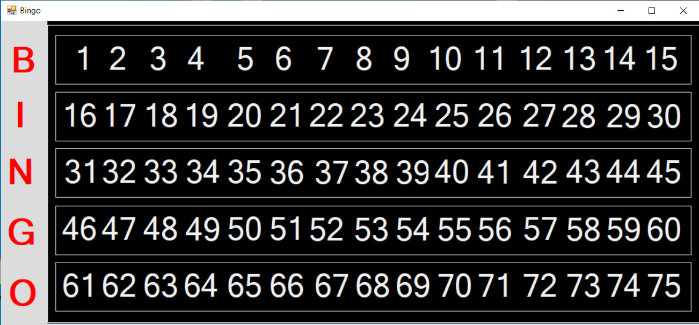

# Bingo

Bingo is a game I played as a child. I used to go with my parents to the Bingo hall. Occasionlly I would play with the other kids that were there, but most of the time I would join my parents and play the games. I created the game so that I could play with my kids.

It's an easy game. You pick a card or card(s). There is a Bingo caller who calls the numbers, from 1 - 75, until someone gets a bingo. Various games are played. A traditional Bingo game is played by getting all numbers that form a straight line, diagonal or four corners. The player yells out Bingo, the numbers are checked to verify that the Bingo is valid, if so, the game ends and a new game begins, if the Bingo is not valid, the game continues until there is a valid winner. 

Special games are played in a session of Bingo. Games such as speed Bingo where a win consists of covering all the numbers on your card, also known as Blackout. The numbers are called faster than normal, most people stick to one or two cards during this type of game. 

During a normal round of Bingo you can play as many cards as you can afford. The more cards you buy the more you pay.  It's your preference. Some people find playing too many cards can be difficult to keep up with and stick with 1-4 cards, while others find that playing 8-12 a little more challenging and fun. It's up to you. In this game we are playing for fun, so you can play as many cards as you want. 

The Bingo C# application is used to simulate the Bingo Caller. I recorded my children calling out the numbers. Automating the calling of numbers allows all participants to play so there is no need to designate a person to call the numbers, using this app.  Players choose their cards. You can purchase playing cards on amazon, you may be able to find some free cards online. The cards consist of 5-B's, 5-I's, 4-N's, 5-G's, 5-O's.  Numbers 1-15 are fall under the letter 'B', numbers 16-30 under the letter I, numbers 31-45 under letter N, numbers 46-60 under letter G and numbers 61-75 under letter O. To start the game right click on the Bingo Board (main screen) and select the game you want to play. 

You can choose between a regular or a speed version of the game. Then right click and select "Start Game". The game begins and the numbers are called out one by one until someone stops the game. Once a player has a Bingo, right click on game and select stop. The game is paused and no other numbers will be called. The players card is compared to the Bingo board to determine if the numbers that were marked on the players card were called. If a player has created a Bingo and marked a number that has not been called, the player does not win the game and the game goes on until a valid Bingo is created. 

The game continues when you answer the prompt asking if it was a valid Bingo. When you select no, the game goes on, if you select that the game was valid, the game ends, and you can restart the game. 
